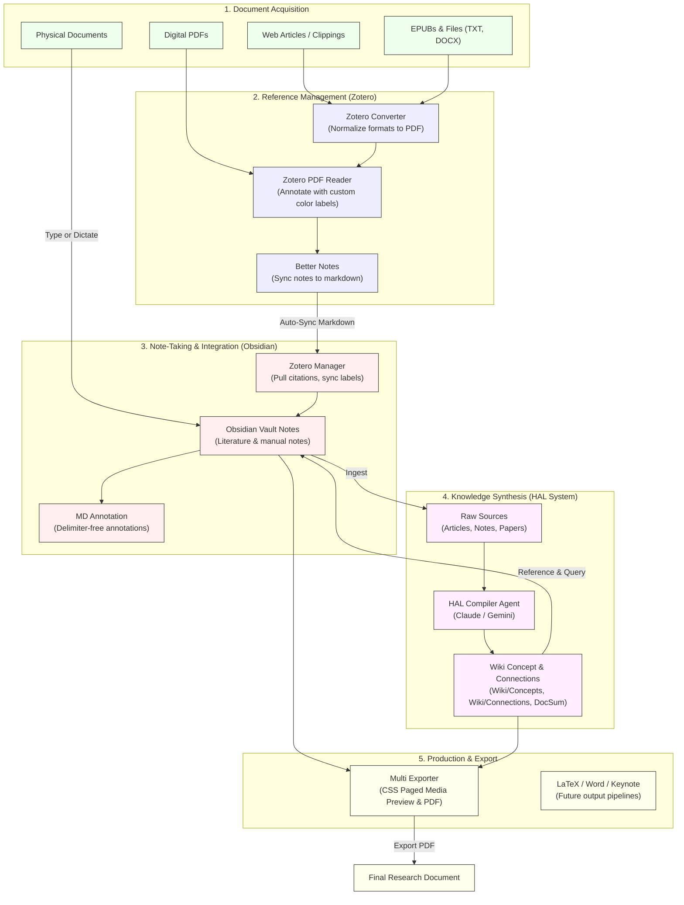
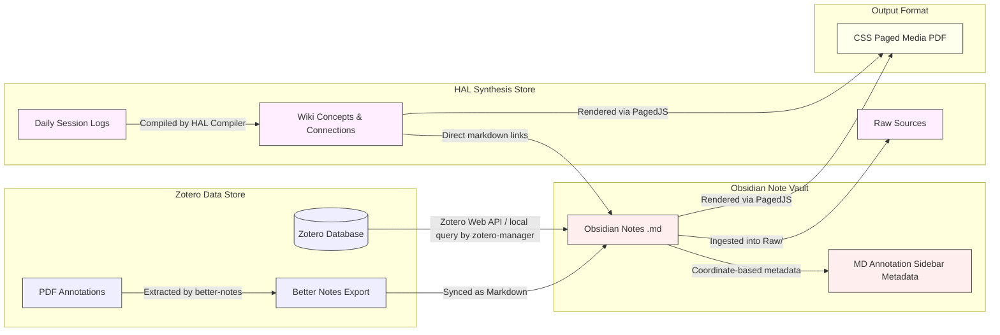

# Integrated Research & Publishing Environment

This repository documents the setup, design, and integration of a modernized literature research, knowledge synthesis, and document publishing environment tailored for PhD-level research. By coupling Zotero's reference management capabilities with Obsidian's knowledge base features and the structured compilation of the HAL system, this setup forms a secure and efficient workspace for managing academic projects.

---

## Workflow Overview

The integrated environment standardizes document collection, annotation, concept mapping, and publishing into a systematic pipeline. It replaces fragmented workflows with a unified, compiler-driven knowledge graph. The workflow consists of the following core tasks:

- **Reading and Annotating PDFs in Zotero**: Digital sources of all types are converted to PDF format and annotated (using highlights and comments linked to specific highlight colors) directly in Zotero's native reader. Notes are then automatically exported and kept in sync with Obsidian.
- **Creating and Annotating Markdown in Obsidian**: Researchers can create original markdown notes and annotate both synced literature notes and original files using [MD Annotation](md-annotation.html), a delimiter-free, out-of-band annotation sidebar that preserves the clean plain-text structure of note bodies.
- **Synthesizing Knowledge via the HAL System**: Notes and articles are collected in a structured vault system inside `VaultSchar` (modeled after a compiler architecture) where an LLM compiler agent automatically indexes materials, writes document summaries (`DocSum/`), and identifies logical connections (`Connections/`) to build a cross-referenced research wiki.
- **Adding Citations Directly from Zotero**: Citations and bibliography details are pulled dynamically into Obsidian notes using [Zotero Manager](zotero-manager.html), supporting both local database queries and cloud Web API fallbacks.
- **Publishing and Document Export**: Finished articles, reports, or research summaries are compiled directly from Obsidian into publication-ready PDFs using [Multi Exporter](multi-exporter.html) with CSS Paged Media. Future output pipelines will support LaTeX, Microsoft Word/Powerpoint, and Apple Keynote.

---

## Workflow Diagrams

### Basic Workflow Pipeline
The diagram below maps the step-by-step researcher workflow from document acquisition through reference curation, note-taking, knowledge base compilation, and document publishing.

### Data Flow Diagram
The diagram below illustrates how data flows between the primary databases and files across software systems, illustrating sync boundaries and compiler ingestion.

---

## Software & Plugin Overview

Detailed specifications, feature matrices, setup requirements, and migration information for each component are provided on their dedicated subpages:

- **[Better Notes for Zotero](better-notes.html)**: A safe, sandbox-oriented fork of `zotero-better-notes` that synchronizes PDF reader annotations with Obsidian notes using Liquid templates and TypeScript security.
- **[Zotero Highlighter Descriptions](highlighter-descriptions.html)**: A Zotero plugin that maps default highlight colors to custom semantic and cognitive coding labels.
- **[Zotero Converter](zotero-convert.html)**: A Zotero utility plugin that converts non-PDF digital documents (EPUBs, web clippings, text files) into standardized PDF formats for unified annotation.
- **[Zotero Manager for Obsidian](zotero-manager.html)**: A modernized integration plugin that pulls citations, references, and annotations into Obsidian, supporting Web API fallback and Nunjucks persist blocks.
- **[MD Annotation for Obsidian](md-annotation.html)**: A delimiter-free markdown annotation and comment plugin that stores highlights out-of-band to preserve note body clean text.
- **[Multi Exporter for Obsidian](multi-exporter.html)**: A desktop-only Obsidian exporter that pagination-renders previews and PDFs using CSS Paged Media.
- **[HAL System](hal.html)**: A compiler-modeled research compiling vault inside `VaultSchar` that structures raw notes and daily session logs into a consistent academic wiki.
